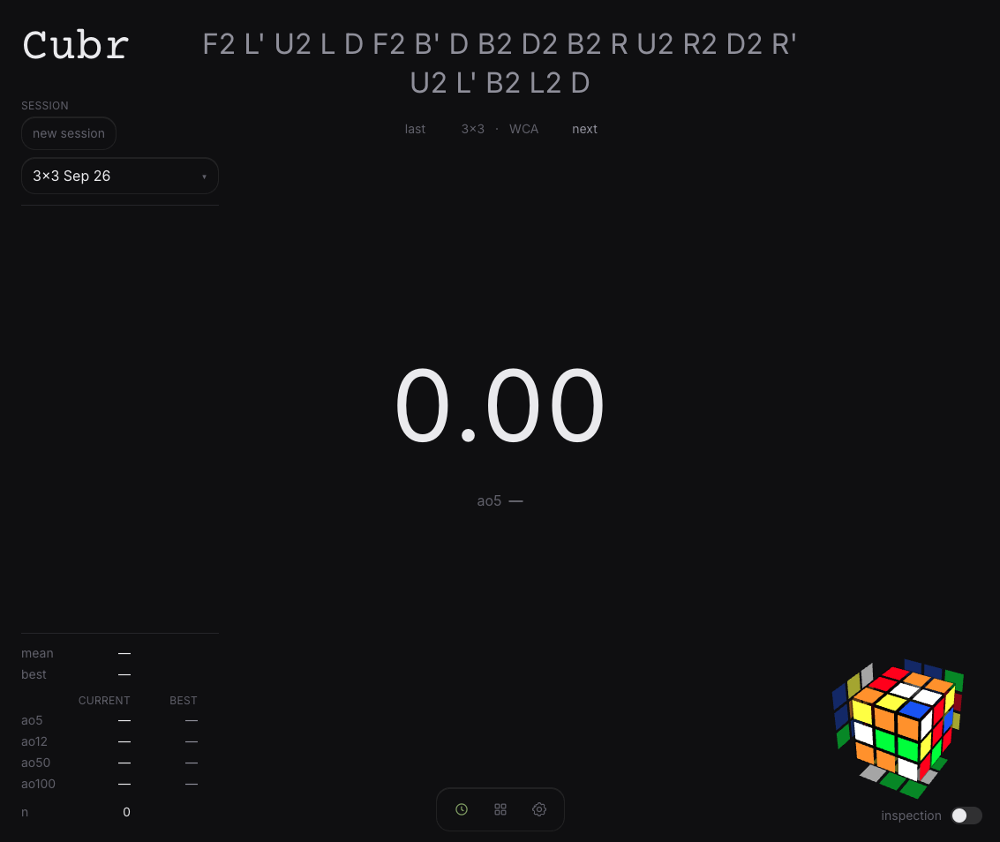

# Cubr

A speedcubing timer that stays out of the way.

**[cubr.vercel.app](https://cubr.vercel.app)**



Cubr is a cube timer I built for myself. Open it and time. There is no landing page, no account, and no onboarding. The first thing you see is the timer.

Times live in your browser. Clearing site data deletes them. That is intentional.

## Features

- WCA-style timer with optional 15-second inspection
- Keyboard, tap, manual entry, and GAN Bluetooth
- Sessions across WCA events — 2×2 through 7×7, OH, BLD, FMC, mega, pyra, skewb, sq1, clock
- Penalties, DNF, and WCA averages (ao5, ao12, ao50, ao100)
- 3D scramble preview
- Subset scrambles: WCA, F2L, OLL, PLL, ZBLL, CMLL, L6E
- Algorithm library — 57 OLL cases (named and grouped by shape) and 21 PLL
- Settings as an overlay so the timer never unmounts underneath

## Stack

The public product is the frontend. Everything else is optional.

| Layer | |
| --- | --- |
| App | React 19, TypeScript, Vite, Tailwind 4, React Router |
| Local store | Dexie (IndexedDB) |
| Scrambles & 3D | [cubing.js](https://js.cubing.net/cubing/) |
| Hosting | Vercel, static |

`backend/` is a Spring Boot + Postgres API I run locally as a backup of my own times. No auth, localhost only, not deployed with the site.

## Run locally

```bash
cd frontend
npm install
npm run dev
```

Then open [http://localhost:5173](http://localhost:5173).

```bash
npm run build
npm run typecheck
npm run lint
```

## Optional local API

Only needed if you want the same backup path I use.

1. Java 21, Maven, and Postgres 16
2. A `cubr` database on `localhost:5432`
3. `DB_PASSWORD` in the environment
4. From `backend/`: `./mvnw spring-boot:run`

CORS is locked to `http://localhost:5173`. The frontend writes to IndexedDB first and can enqueue a copy to this API. The live site does not call it.

## Algorithm data

OLL and PLL lists are a snapshot from [CubingApp](https://github.com/spencerchubb/cubingapp) (MIT, Spencer Chubb). Case names follow Speedsolving Wiki conventions. Diagrams are last-layer SVGs generated from inverted algorithms.

## Why

Most cube timers have become products: accounts, leaderboards, marketing pages. Cubr is the opposite. `/` is the timer. Data stays on the device. There will not be a login wall.

That is the whole point.

## Credits

- [cubing.js](https://github.com/cubing/cubing.js) for scrambles and the 3D cube
- [CubingApp](https://github.com/spencerchubb/cubingapp) for the OLL / PLL algorithm lists
- OLL names from the [Speedsolving Wiki](https://www.speedsolving.com/wiki/)

Built by [Sanay Kothalkar](https://github.com/SanayKoth).
